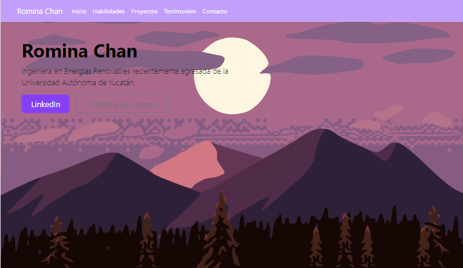

# 🚀 Mi portafolio de habilidades TECNOLOCHICAS PRO

Este proyecto es un portafolio creado para poner en práctica las habilidades adquiridas en el bootcamp de desarrollo frontend de **Tecnolochicas PRO**.

💻 Desarrollado con **HTML, CSS y JavaScript**, utilizando el framework de UI, **Bootstrap**, además de bibliotecas externas.

📱 La página es completamente **responsiva**, adaptándose a diferentes tamaños de pantalla. Incluye una sección de presentación de la autora del proyecto, destacando sus habilidades y experiencias.

🌟 Puedes visitar el sitio terminado aquí --> [Proyecto desplegado](https://rominachan.me/)

## Secciones del sitio

## Tecnologías
* HTML
* CSS
* Bootstrap
* JavaScript

---
Desarrollado con  💜 por [Romina Chan](https://www.linkedin.com/in/rominachan2801/) en [TECHNOLOCHICAS PRO](https://tecnolochicas.mx/)
